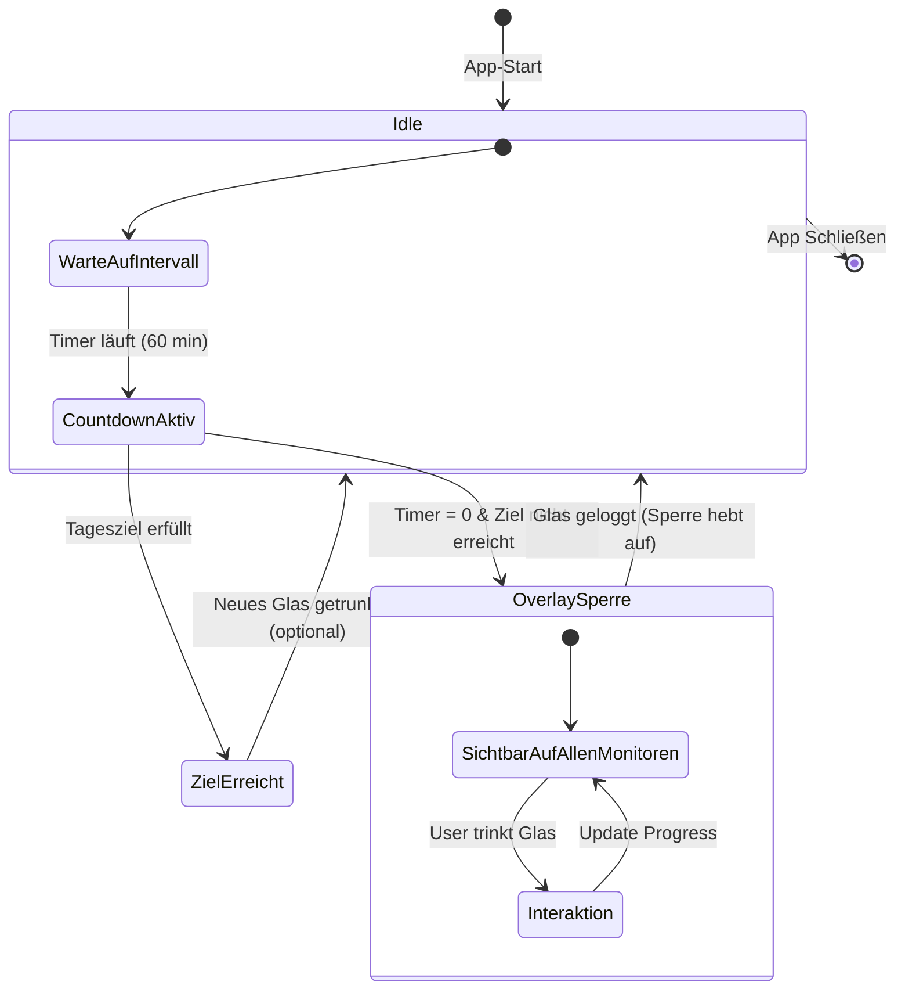

[← Zurück zur Übersicht](../README.md)

# Pflichtenheft: HydrationFreeze

**Projekt:** HydrationFreeze (Technische Spezifikation)  
**Version:** 1.4.2 (Abgeglichen mit Quellcode & Lastenheft v1.4.2)  
**Status:** Aktiv / Finalisiert für Release v1.4.2

---

## 1. Technische Architektur
- **Frameworks:** - `SwiftUI`: Gesamte Benutzeroberfläche und Datenbindung.
    - `AppKit`: Fenster-Management (`NSPanel`) für die System-Sperre.
    - `Swift Charts`: Visualisierung der Trink-Historie.
- **Datenhaltung:** `@AppStorage` (UserDefaults) zur Persistenz von Konfigurationsdaten und JSON-Kodierung für das Langzeit-Log (`[HydrationLog]`).
- **Einstiegspunkt:** `MenuBarExtra` sorgt für einen ressourcensparenden Betrieb in der macOS Statusleiste.

---

## 2. Detaillierte Systemfunktionen (PF)

### 2.1 [ /PF10/ ] Dynamischer Overlay-Mechanismus
- **Klasse:** `OverlayManager`.
- **Umsetzung:** Erzeugung von `NSPanel`-Instanzen mit `styleMask: .borderless` auf dem Level `.screenSaver`.
- **Multi-Monitor-Support:** Automatisierte Iteration über `NSScreen.screens`.
- **Adaptive Skalierungslogik (Neu in v1.4.2):** Die `OverlayView` berechnet die Icon-Größe $S_{Icon}$ dynamisch in Abhängigkeit der Gesamtzahl der benötigten Gläser ($n_{Total}$), um die Bildschirmbreite optimal zu nutzen:
  $$S_{Icon} = \begin{cases} 45 & \text{wenn } n \leq 8 \\ 35 & \text{wenn } 8 < n \leq 12 \\ 25 & \text{wenn } 12 < n \leq 20 \\ 20 & \text{wenn } n > 20 \end{cases}$$
  
  ```mermaid
  sequenceDiagram
    autonumber
    participant App as AppState / User
    participant OM as OverlayManager
    participant Calc as Logic (dynamicIconSize)
    participant NS as NSScreen.screens
    participant UI as OverlayView (NSPanel)

    App->>OM: Trigger: Intervall erreicht
    Note over OM: Start Lock-Prozess
    
    OM->>Calc: Sende n_Total (Gläser für Ziel)
    Note right of Calc: Anwendung der Fallunterscheidung<br/>(45pt, 35pt, 25pt, 20pt)
    Calc-->>OM: Return S_Icon (optimierte Größe)
    
    OM->>NS: Erfrage alle aktiven Displays
    
    loop Für jeden gefundenen Monitor
        OM->>UI: Initialisiere Vollbild-Overlay
        UI->>UI: Rendere Grid mit S_Icon
        Note over UI: Level: .screenSaver (Topmost)
    end
    
    OM-->>App: Status: System gesperrt
```


### 2.2 [ /PF20/ ] Adaptive Benutzeroberfläche & Interaktion
- **Dynamisches Grid:** Nutzung von `max(glassesNeededForGoal, glassesDrunk)` für die Generierung der Button-Reihe. Dies stellt sicher, dass das Ziel visualisiert wird, auch wenn noch nichts getrunken wurde.
- **Responsives Design:** Einbettung der `glassesRow` in eine horizontale `ScrollView` und dynamisches Spacing, um Überlappungen bei extremen Konfigurationen (z. B. 100ml Gläser bei 5L Ziel) zu verhindern.
- **Erfolgs-Feedback:** Bedingte Formatierung des Headers; Wechsel zu `.green` und `checkmark.circle.fill` bei Erreichung von `isGoalReached`.




### 2.3 [ /PF30/ ] Statistik-Engine (Swift Charts)
- **Dynamische Ziellinie:** Implementierung einer `RuleMark` auf der Y-Achse, die an die Variable `dailyGoal` (in Litern) gebunden ist.
- **Status-Indikatoren:** - Blaues Gradient-Design bei Unterschreitung des Ziels.
    - Grünes Gradient-Design bei Erreichung oder Überschreitung des Ziels.
- **Archivierung:** Die Funktion `getHistory()` aggregiert die Tageswerte und stellt sicher, dass Änderungen der Glasgröße rückwirkend für den aktuellen Tag korrekt berechnet werden.

### 2.4 [ /PF40/ ] Konfigurations-Management (Refactoring v1.4.2)
- **Nutzerschnittstelle:** Umstellung der `SettingsView` auf Apple Human Interface Guidelines (HIG) konformes Layout:
    - Einsatz von `Form`-Clustern zur Strukturierung.
    - Verwendung von `LabeledContent` zur sauberen Trennung von Deskriptor und Steuerelement.
    - Kompakte Darstellung durch `.controlSize(.regular)` und `.buttonStyle(.borderless)`.

### 2.5 [ /PF50/ ] Daten-Export & Synchronisation
- **CSV-Schnittstelle:** Nutzung von `NSSavePanel`. Export-Format: `Datum;Liter` (Dezimal-Komma-Konvertierung für EU-Excel-Kompatibilität).
- **Mobile-Sync:** Integration des statischen QR-Code Assets zur Kopplung mit dem iOS-System.

---

## 3. Test-Szenarien & Abnahme (Qualitätssicherung)

Zur Sicherstellung der Softwarequalität wurden spezifische Testmethoden (Black-Box-Testing) angewandt:

| Referenz | Testmethode | Szenario / Eingabe | Erwartetes Ergebnis | Status |
| :--- | :--- | :--- | :--- | :--- |
| **PF10 / LF30** | Äquivalenzklasse | Ziel: 4L, Glas: 200ml (20 Icons) | Icons skalieren auf 25pt; Layout bleibt stabil. | ✅ |
| **PF40 / LF35** | UI-Regression | Öffnen der Einstellungen | LabeledContent-Alignment gemäß macOS HIG. | ✅ |
| **PF20 / LF60** | Zustandswechsel | Zielerreichung im Overlay | Header wechselt zu grünem Haken & Checkmark. | ✅ |
| **PF10 / TC-10** | **Grenzwertanalyse** | Ziel: 5L, Glas: 100ml (50 Icons) | Korrekte Berechnung ($V_{total} = 5.0L$); ScrollView aktiv. | ✅ |
| **PF10 / TC-11** | **Entscheidungstabelle** | Timer abgelaufen + Ziel bereits erreicht | Sperre triggert trotzdem (Pause-Funktion); Erfolg angezeigt. | ✅ |
| **PF10 / TC-12** | **Robustheitstest** | Monitor-Trennung während Sperre | `OverlayManager` berechnet Layout sofort neu. | ✅ |
| **PF40 / LF70** | Datenvalidierung | CSV-Export (EU-Format) | Valide Datei; Dezimal-Komma statt Punkt genutzt. | ✅ |

> **Hinweis:** Eine detaillierte Aufschlüsselung der Testdurchführung inklusive Zeitstempel und Defect-Reports findet sich in der separaten [Testdokumentation](./TESTDOKUMENTATION.md).

---

## 4. Wartung & Roadmap
- **v1.5.0:** Integration von Push-Notifications bei verpassten Intervallen.
- **v1.6.0:** Optionale Anbindung an die Apple Health API (macOS).

[← Zurück zur Übersicht](../README.md)
