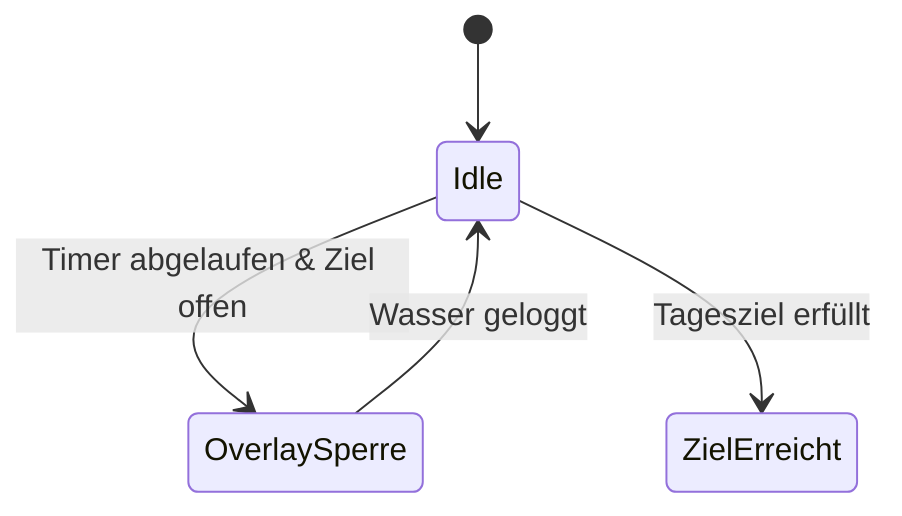

# 💧 HydrationFreeze (macOS)

> **Ein intelligenter Trink-Reminder, der deinen Workflow schützt, indem er dich zur Hydration zwingt.**

---

## 📖 Projektdokumentation
Besuche die **[interaktive Dokumentations-Seite](https://dodo377.github.io/HydrationFreeze2.0/)** für eine saubere Leseansicht:

* [**Lastenheft**](./HydrationFreeze/LASTENHEFT.md) | [**Pflichtenheft**](./HydrationFreeze/PFLICHTENHEFT.md) | [**Testdokumentation**](./HydrationFreeze/TESTDOKUMENTATION.md) | [**Changelog**](./HydrationFreeze/CHANGELOG.md)

---

## 🧠 Funktionsweise (Logic Flow)
Die App folgt einer strikten Zustandslogik, um sicherzustellen, dass du dein Tagesziel erreichst:

---

## ✨ Features (v1.4.2 Update)

- **Adaptive UI & Smart Scaling**: Das Overlay berechnet die Icon-Größe dynamisch. Egal ob 4 große Gläser oder 20 kleine Tropfen – das Interface skaliert verlustfrei und überlappungsfrei.
- **Individuelle Glasgröße**: Konfiguriere dein Standard-Gefäß (100ml bis 1000ml) für präzises Tracking.
- **Dynamisches Tagesziel**: Setze dein persönliches Limit (z.B. 2,5L) – die App passt die benötigte Tropfenanzahl und die Erfolgsmeldungen automatisch an.
- **macOS Native Design**: Eine komplett überarbeitete Einstellungsansicht nach Apple Human Interface Guidelines für ein nahtloses Systemerlebnis.
- **Smart Blocking Overlay**: Legt sich über alle Monitore auf System-Level. Die Fortschrittsanzeige berechnet sich live aus deiner konfigurierten Glasgröße.
- **Adaptive Statistik**: Ein Dashboard mit **Swift Charts**, inklusive dynamischer Ziellinie (`RuleMark`), die mit deinem Ziel mitwandert.
- **Robuster Tages-Reset**: Erkennt Datumswechsel zuverlässig beim App-Start und beim Aufwachen des Macs (Wake-from-Sleep).
- **Mobile-Sync**: Ein statischer QR-Code erlaubt das schnelle Loggen in Apple Health via iPhone Kurzbefehl.

---

## 🚀 Installation & Setup

### 1. Xcode Konfiguration
Damit die App ordnungsgemäß funktioniert, müssen folgende Einstellungen in Xcode vorgenommen werden:
- **App Sandbox**: Muss deaktiviert sein (`Signing & Capabilities`), damit die App Fenster über das System-Level (`.screenSaver`) legen darf.
- **LSUIElement**: Setze `Application is agent (UIElement)` in der `Info.plist` auf `YES`, um das Dock-Icon auszublenden.

### 2. iPhone Kurzbefehl (Shortcut)
Für die Synchronisation mit Apple Health:
1. Öffne die **Kurzbefehle**-App auf deinem iPhone.
2. Erstelle einen neuen Kurzbefehl mit dem Namen **`WasserLog`**.
3. Füge die Aktion **"Wasser protokollieren"** hinzu.
   - *Tipp: Nutze als Wert die gleiche Menge, die du in HydrationFreeze als Glasgröße eingestellt hast.*
4. Scanne den QR-Code im Mac-Overlay zum schnellen Ausführen.

---

## 🛠 Bedienung

| Bereich | Funktion |
| :--- | :--- |
| **Optionen** | **Neu:** Natives macOS-Layout für Intervalle, Sperrdauer, Glasgröße (ml) und Tagesziel (L). |
| **Sperrbildschirm** | **Adaptive Darstellung:** Klicke auf die Tropfen zum Loggen – die Icons skalieren automatisch bei hohen Zielen. |
| **Statistik** | Visualisiert die letzten 14 Tage. Balken wechseln die Farbe zu Grün, sobald dein individuelles Ziel erreicht ist. |
| **Export** | Speichert die Historie als lokalisierte `;`-separierte CSV-Datei (Excel/Numbers kompatibel). |

---

## 📂 Projektstruktur

- `HydrationFreezeApp.swift`: Steuerzentrale der App, Timer-Logik und Menüleisten-Steuerung.
- `OverlayManager.swift`: Fenster-Management (`NSPanel`) und Multi-Monitor-Logik.
- `OverlayView.swift`: **Herzstück der v1.4.2** – Berechnet das adaptive Icon-Scaling und die Ziel-Visualisierung.
- `SettingsView.swift`: Konfiguration im nativem Design, Swift Charts Statistik und QR-Sync.

---

## 🛡 Systemanforderungen

- **OS**: macOS 14.0+ (Optimiert für macOS 15+ / Apple Silicon & Intel)
- **Status**: Validiert für Release v1.4.2 (2026)

---

## 📄 Lizenz

Dieses Projekt ist unter der **MIT-Lizenz** lizenziert. Details findest du in der [LICENSE.md](LICENSE.md).
